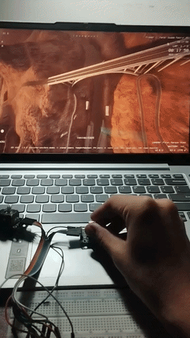
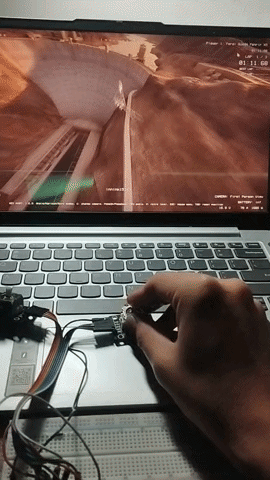

# ESP32-S3 Dual-Joystick Drone Sim Controller

Turns an ESP32-S3 + two cheap analog joystick modules into a native USB HID
gamepad your PC will recognize as a normal joystick — no drivers needed.
Works with most PC drone simulators (Liftoff, FPV FreeRider, Velocidrone,
DRL Sim, etc.), since they all read from Windows/Linux game controller
input.




## Requirements

- ESP32-S3 dev board **with native USB exposed** (the D+/D- pins wired to
  a USB connector — most ESP32-S3-DevKitC / S3 boards have this on the
  port labeled "USB", separate from the "UART" port used for flashing).
- 2x analog joystick modules (the common breakout with VRx, VRy, SW pins).
- ESP-IDF v5.1 or newer installed (`idf.py --version` to check).

## Wiring

| Joystick | Signal | ESP32-S3 pin |
|---|---|---|
| Left (throttle/yaw) | VRx | GPIO4 |
| Left | VRy | GPIO5 |
| Left | SW (button) | GPIO6 |
| Right (roll/pitch) | VRx | GPIO7 |
| Right | VRy | GPIO8 |
| Right | SW (button) | GPIO9 |
| Both | VCC | 3V3 |
| Both | GND | GND |

Optional extra momentary switches (e.g. an arm switch): GPIO10, GPIO11,
wired to GND when pressed (internal pull-ups are enabled in software).

All pins are defined at the top of `main/main.c` under `CONFIG: pins` —
change them freely if your wiring differs.

## Build & flash

```bash
Remove-Item Env:\IDF_TARGET -ErrorAction SilentlyContinue
Remove-Item -Recurse -Force build -ErrorAction SilentlyContinue
Remove-Item -Force sdkconfig -ErrorAction SilentlyContinue
Remove-Item -Force sdkconfig.old -ErrorAction SilentlyContinue
$env:IDF_TARGET = "esp32s3"
idf.py set-target esp32s3
idf.py build
```

The first build will fetch the `espressif/tinyusb` managed component
automatically (needs internet access once).

After flashing, **unplug the flashing/UART cable and plug the board's
native USB port into your PC instead** (on some boards flashing and USB
share the same port — check your board's documentation). It should
enumerate as "ESP32S3 Drone Controller".

## Axis mapping

Standard "Mode 2" RC layout:

- Left stick X → **Yaw** (report axis Z)
- Left stick Y → **Throttle** (report axis Rz)
- Right stick X → **Roll** (report axis X)
- Right stick Y → **Pitch** (report axis Y)

If any axis is reversed for your sim, flip the corresponding
`INVERT_*` define (0 → 1) near the top of `main.c` and reflash — no need
to touch the simulator settings.

## Calibrating in your simulator

1. Plug the board in; confirm your OS sees a new joystick (Windows:
   "Set up USB game controllers"; Linux: `jstest /dev/input/js0` or
   `evtest`).
2. Open the simulator's controller/input settings and run its
   calibration/auto-detect step, wiggling both sticks to their full
   range and centering them.
3. Bind throttle/yaw/pitch/roll and the two stick-click buttons to
   whatever functions you like (arm, mode switch, etc.) inside the sim.

## Tuning

- `DEADZONE` — raw ADC counts of dead zone around center (default 60,
  \~1.5% of range). Increase if your sticks don't self-center to exact 0.
- `REPORT_INTERVAL_MS` — USB report rate (default 4 ms ≈ 250 Hz).
- If your particular joystick modules don't center at the ADC midpoint
  (2048), you can add a per-axis calibration offset; ping me if you'd
  like that added (e.g. auto-calibrate on boot by sampling center
  position for a second before use).
